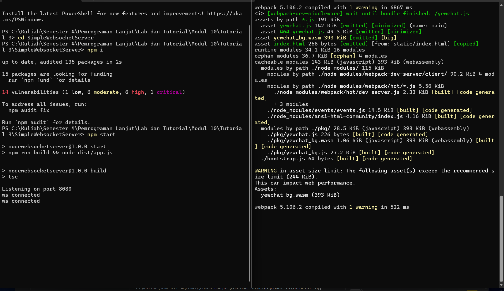
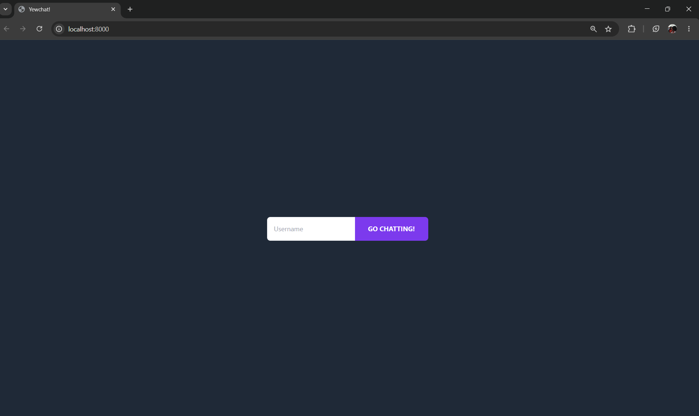
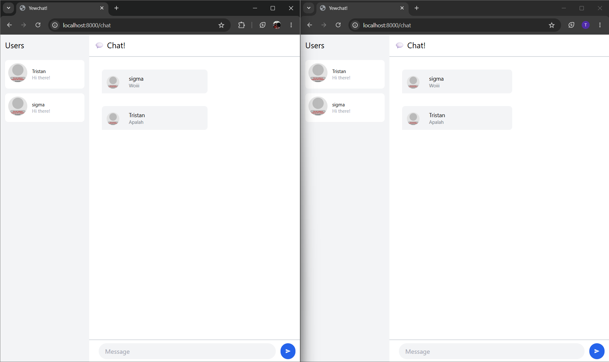
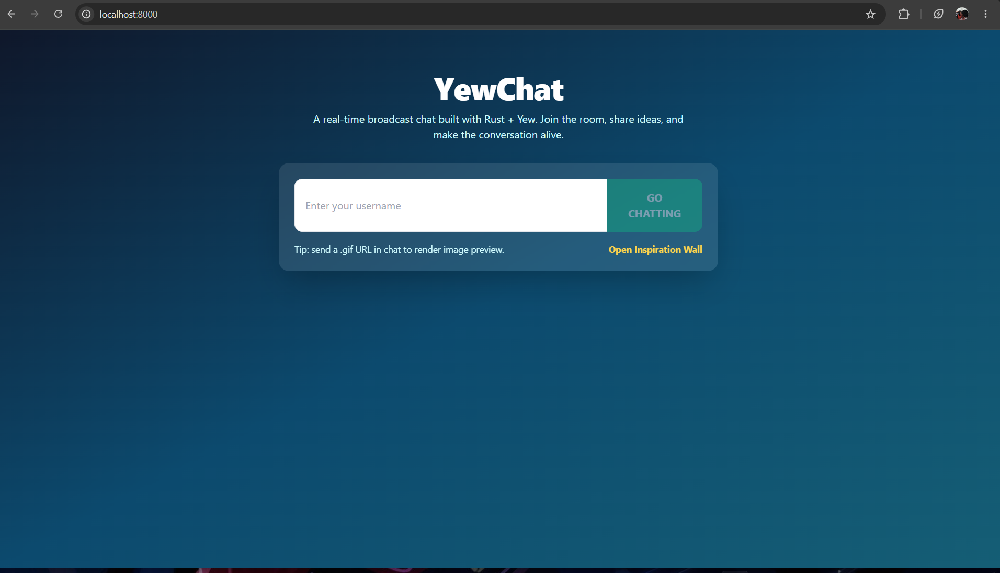
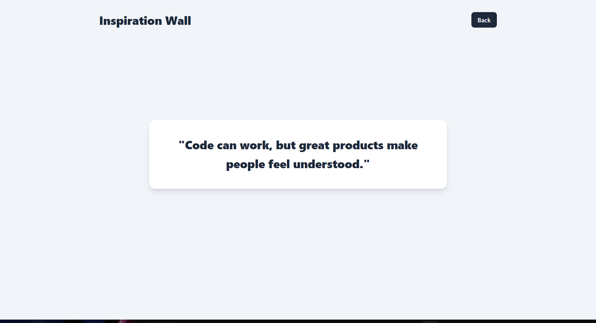
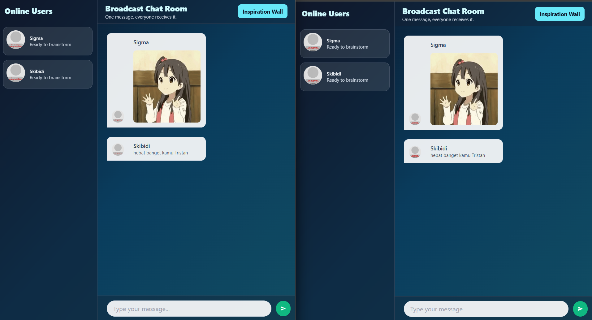

# Tutorial 3 - YewChat

## Cara Menjalankan

1. Jalankan WebSocket server:

```bash
cd SimpleWebsocketServer
npm i
npm start
```

Server default jalan di `ws://localhost:8080`.

2. Di terminal lain, jalankan YewChat:

```bash
cd YewChat
npm i
npm start
```

Aplikasi default dibuka di `http://localhost:8000`.

# Bagian 3.1

## Yang Saya Coba (Play With It)

1. Menjalankan server dan memastikan terminal menampilkan server aktif.
2. Menjalankan frontend YewChat di browser.
3. Mencoba koneksi ke WebSocket server.
4. mencoba kirim pesan antar 2 tab browser.
5. Mengamati update daftar user aktif saat tab dibuka/ditutup.

## Hasil Pengamatan Singkat

- Arsitekturnya dipisah: backend WebSocket sendiri, frontend Yew sendiri.
- Komunikasi real-time berjalan lewat event WebSocket (`register`, `message`, dan update user list).

### Terminal Server dan Yewchat



### Landing page



### Demo Chat



# Bagian 3.2

## Add Some Creativities to the Web Client

Pada bagian ini saya menambahkan beberapa elemen ke YewChat.

1. Memperbarui tampilan landing page yewchat.
2. Menambahkan halaman tambahan (Inspiration Wall) sebagai another page dari aplikasi.
3. Memperbarui tampilan chat room dan mencoba kirim pesan berbentuk URL GIF agar bisa ditampilkan di area chat.

### Landing Page After



### Another Page (Inspiration Wall)



### Chat Room After


