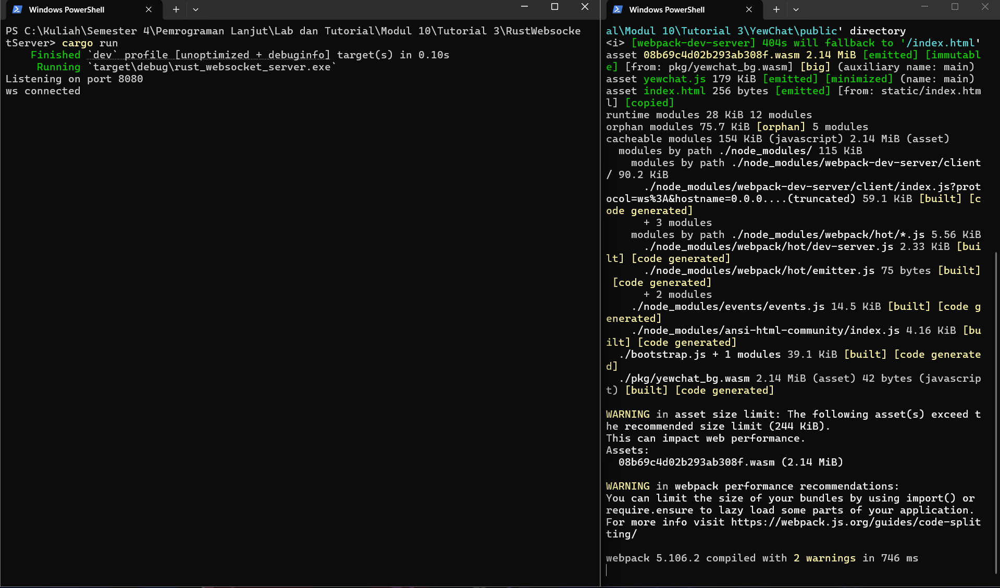

# Tutorial 3 - YewChat

## Cara Menjalankan

1. Jalankan WebSocket server:

```bash
cd SimpleWebsocketServer
npm i
npm start
```

Server default jalan di `ws://localhost:8080`.

2. Di terminal lain, jalankan YewChat:

```bash
cd YewChat
npm i
npm start
```

Aplikasi default dibuka di `http://localhost:8000`.

# Bagian 3.1

## Yang Saya Coba (Play With It)

1. Menjalankan server dan memastikan terminal menampilkan server aktif.
2. Menjalankan frontend YewChat di browser.
3. Mencoba koneksi ke WebSocket server.
4. mencoba kirim pesan antar 2 tab browser.
5. Mengamati update daftar user aktif saat tab dibuka/ditutup.

## Hasil Pengamatan Singkat

- Arsitekturnya dipisah: backend WebSocket sendiri, frontend Yew sendiri.
- Komunikasi real-time berjalan lewat event WebSocket (`register`, `message`, dan update user list).

### Terminal Server dan Yewchat


### Landing page


### Demo Chat


# Bagian 3.2

## Add Some Creativities to the Web Client

Pada bagian ini saya menambahkan beberapa elemen ke YewChat.

1. Memperbarui tampilan landing page yewchat.
2. Menambahkan halaman tambahan (Inspiration Wall) sebagai another page dari aplikasi.
3. Memperbarui tampilan chat room

### Landing Page After


### Another Page (Inspiration Wall)


### Chat Room After


## Bonus

### Mengganti WebSocket Server JavaScript dengan Rust

Untuk bagian ini saya membuat folder baru `RustWebsocketServer` dan mengimplementasikan server WebSocket versi Rust agar bisa melayani web client dari Tutorial 3.

#### Apa yang saya lakukan

1. Membuat server Rust di `RustWebsocketServer` menggunakan `tokio` + `tokio-tungstenite`.
2. Menyesuaikan protokol agar sama seperti Tutorial 3:
   - client kirim JSON string `register` dan `message`
   - server broadcast JSON string `users` dan `message`
3. Tetap mengirim data lewat frame text WebSocket (bukan binary), jadi JSON tetap serialized/deserialized sebagai text message.
4. Menjalankan uji koneksi dua client, lalu memverifikasi:
   - update daftar users masuk ke semua client
   - pesan dari 1 client dibroadcast ke semua client

#### Kenapa ini berhasil

Perubahan ini berhasil karena kontrak message antara client dan server dibuat identik dengan versi JavaScript.

- `messageType: "register"` menyimpan username per koneksi.
- `messageType: "message"` dibungkus ulang oleh server menjadi data:
  - `from`
  - `message`
  - `time`
- broadcast `users` dan `message` dikirim ke semua client aktif.

### Terminal



#### JavaScript vs Rust version

Menurut saya:

- versi javascript lebih cepat untuk prototyping dan lebih sederhana untuk setup awal.
- versi rust lebih bagus untuk reliability dan maintainability jangka panjang, terutama untuk concurrency dan safety saat jumlah koneksi makin banyak.

Jadi kalau tujuannya cepet jadi, JS enak. Kalau tujuannya server yang kuat dan scalable ya tentu lebih bagus Rust
